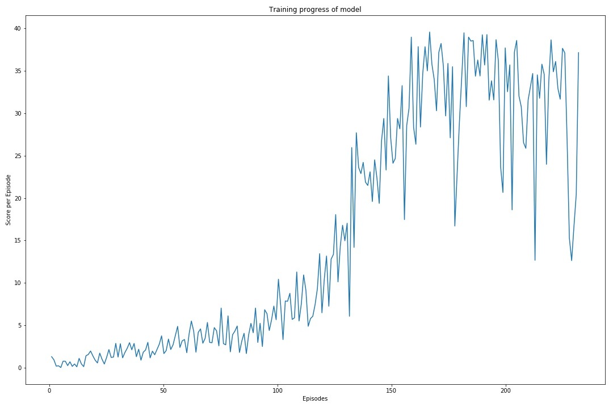

# Project Report 
## Udacity Deep Reinforcement Learning Project 2: Continuous Control 

The purpose of this document is to describe the details of the project; including the algorithm, network architecture, training hyperparameters and results.

In this report I briefly summarize the learnings and final modeling decisions taken as part of the Continuous Control project.I was able to find a setup that solves the environment with around 250 steps but it took some optimizations from the original DDPG code from the Udacity repository to make it work for me.

## Project Overview

[//]: # (Image References)

[image1]: https://github.com/joshnewnham/Udacity_DeepReinforcementLearning_Project2/blob/master/images/reacher.gif "Agent"

![Agent][image1]

The goal of this project was to train an agent to control a double-jointed arm such that it would track a ball around. As described in the project: A reward of +0.1 is provided for each step that the agent's hand is in the goal location. Thus, the goal of your agent is to maintain its position at the target location for as many time steps as possible.

The observation space consists of 33 variables corresponding to position, rotation, velocity, and angular velocities of the arm. Each action is a vector with four numbers, corresponding to torque applicable to two joints. Every entry in the action vector should be a number between -1 and 1.

## Learning Algorithm

In this section we briefly describe the learning algorithm, along with the network architectures used in this project.

Reinforcement learning algorithms can be categoized as either value-based, policy-based or combination of the two. Value-based learning consists of learning a state-action value function (Value/Q-function) that leads to the highest-valued state, by contract the policy-based approach tries to directly learn a (optimal) policy function directly (without the intermediary Value/Q-function).

In the previous [project-1](https://github.com/sysadminamit/Udacity-Deep-Reinforcement-learning-Project-1) we used a value-based algorithm, Deep Q-Network (DQN), to successfuly train an agent to navigate an environment scattered with good and bad bananas. DQN has seen much success dealing with environments with high-dimensional (complex) states but only dealing with discrete actions. Unfortunately value-based algorithms don't scale well when the action space is large, such as when they require a continous output (as its very difficult to converge for large action spaces) such as what is required in this project.

Deep Deterministic Policy Gradient (DDPG) (the algorithm used in this project) builds on DPG but introduces an actor-critic architecture to deal with a large action space (continous or discrete).

 - DDPG is a policy gradient algorithm that uses a stochastic behavior policy for good exploration but estimates a deterministic target policy, which is much easier to learn. Policy gradient algorithms utilize a form of policy iteration: they evaluate the policy, and then follow the policy gradient to maximize performance. Since DDPG is off-policy and uses a deterministic target policy, this allows for the use of the Deterministic Policy Gradient theorem (which will be derived shortly). DDPG is an actor-critic algorithm as well; it primarily uses two neural networks, one for the actor and one for the critic. These networks compute action predictions for the current state and generate a temporal-difference (TD) error signal each time step. The input of the actor network is the current state, and the output is a single real value representing an action chosen from a continuous action space (whoa!). The critic’s output is simply the estimated Q-value of the current state and of the action given by the actor. The deterministic policy gradient theorem provides the update rule for the weights of the actor network. The critic network is updated from the gradients obtained from the TD error signal.
 
The Actor-Critic learning algorithm is used to represent the policy function independently of the value function. The policy function structure is known as the actor, and the value function structure is referred to as the critic. The actor produces an action given the current state of the environment, and the critic produces a TD (Temporal-Difference) error signal given the state and resultant reward. If the critic is estimating the action-value function Q(s,a), it will also need the output of the actor. The output of the critic drives learning in both the actor and the critic. In Deep Reinforcement Learning, neural networks can be used to represent the actor and critic structures.

The figure below illustrates the Actor-critic Architecture (source [Continous Control with Deep Reinforcement Learning](https://arxiv.org/pdf/1509.02971.pdf)).


## Network Architectures.
Throughout my experimentation phase I did not change the basic network architecture much in terms of number of layers and number of units: it was always 2 fully connected hidden layers with ReLu activations for both the actor and the critic. I am using 128/128 units for the two hidden layers in this project. The main improvement to get the agent to train came from a suggestion in the Nanodegree Slack channel: When introducing batch normalization after the first hidden layer for the actor network the training started to get somewhere. Before (with the standard feedforward network and some optimizations outlined below), the training would stall at average score of 1 − 2. I later decided to add one batch normalization layer also in the critic network. Looking at the training progress (see chart below), the smoothing/regularizing effect of batch normalization was pronounced in the sense that training progress started visibly after only a handful of episodes.

## Training

Training (after much experimentation) used the following hyperparameters:

```
BUFFER_SIZE = int(1e5)  # replay buffer size
BATCH_SIZE = 128        # minibatch size
GAMMA = 0.99            # discount factor
TAU = 1e-3              # for soft update of target parameters
LR_ACTOR = 2e-4         # learning rate of the actor 
LR_CRITIC = 2e-4        # learning rate of the critic
WEIGHT_DECAY = 0        # L2 weight decay

```


## Training Plot
The agent was able to solve the environment by achieving score of 30.0 over 100 consecutive episodes after 231 episodes.


## Training Output

```
Episode 100	Average Score: 2.74
Episode 200	Average Score: 23.88
Episode 231	Average Score: 30.19
Environment solved in 231 episodes!	Average Score: 30.19
```

## Future Work
The amount of experimentation that could be performed was somewhat limited by the amount of time is required to perform training; so an obvious first point is further experimentation on the network architecture to find a more optimum actor and critic architecture. Some other thoughts include:

 - Introduce a decay to the noise added to the action to improve stability.
 - Use a priority algorithm for sampling from the replay buffer instead of uniformly sampling
 - Use recurrent networks to capture temporal details of the environment.
